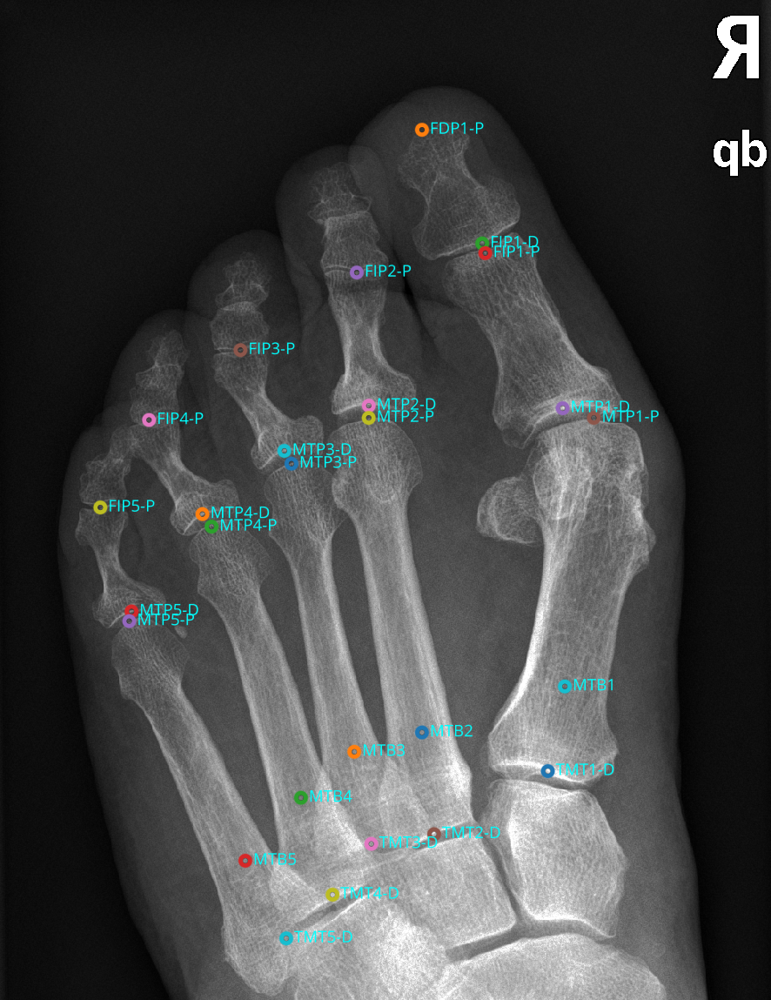
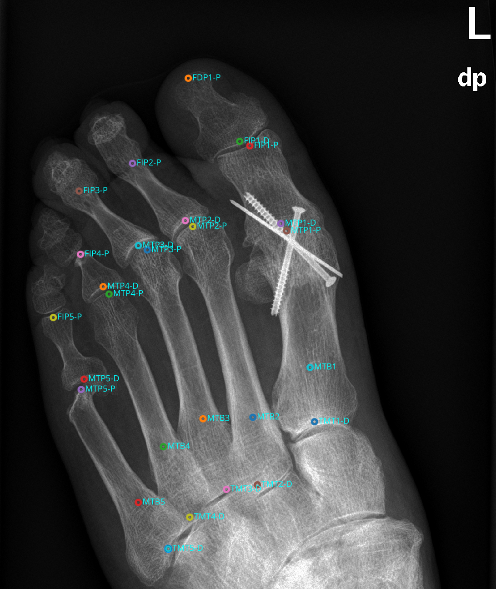
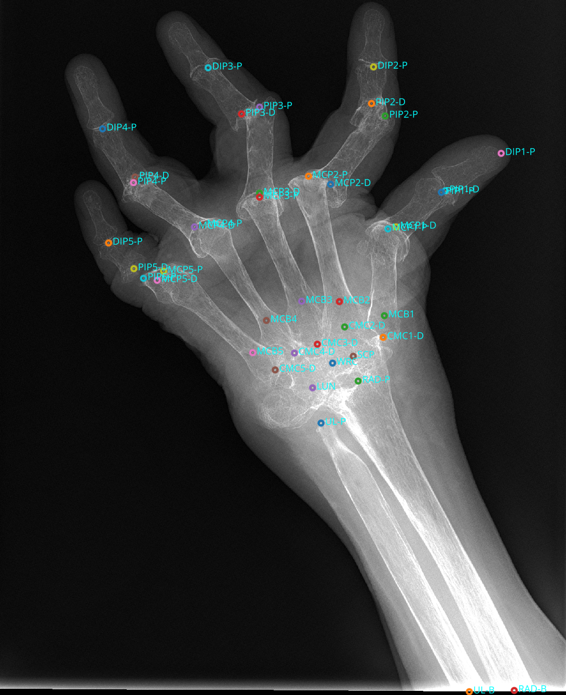
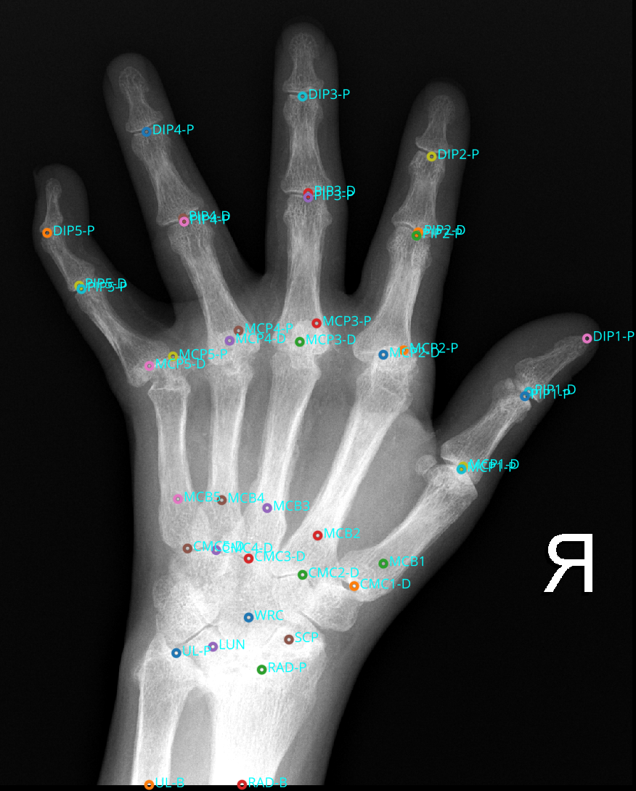
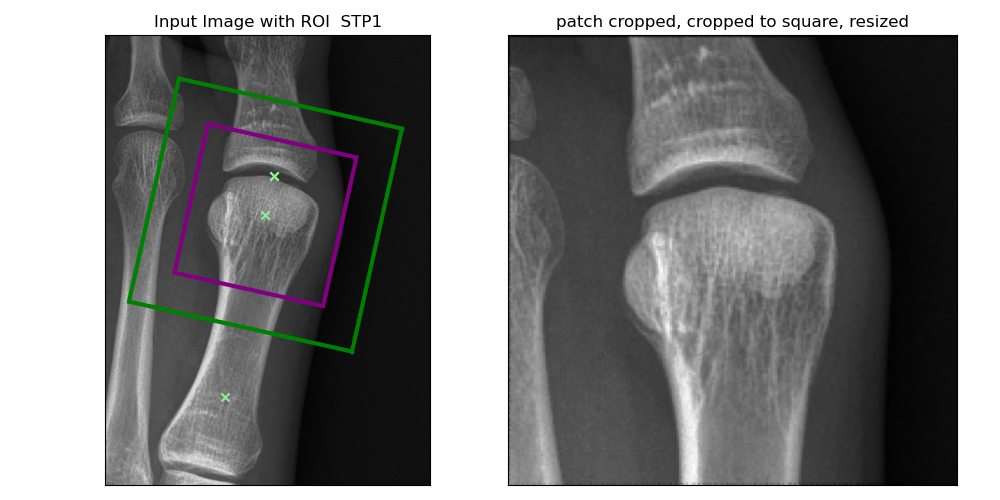
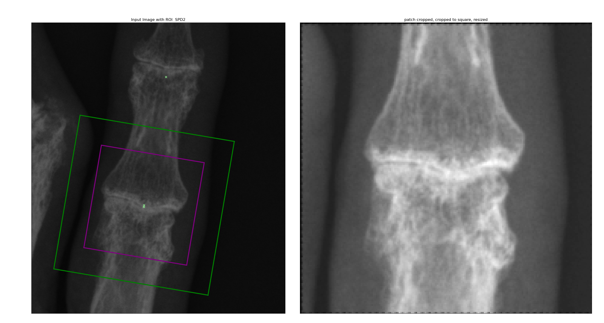
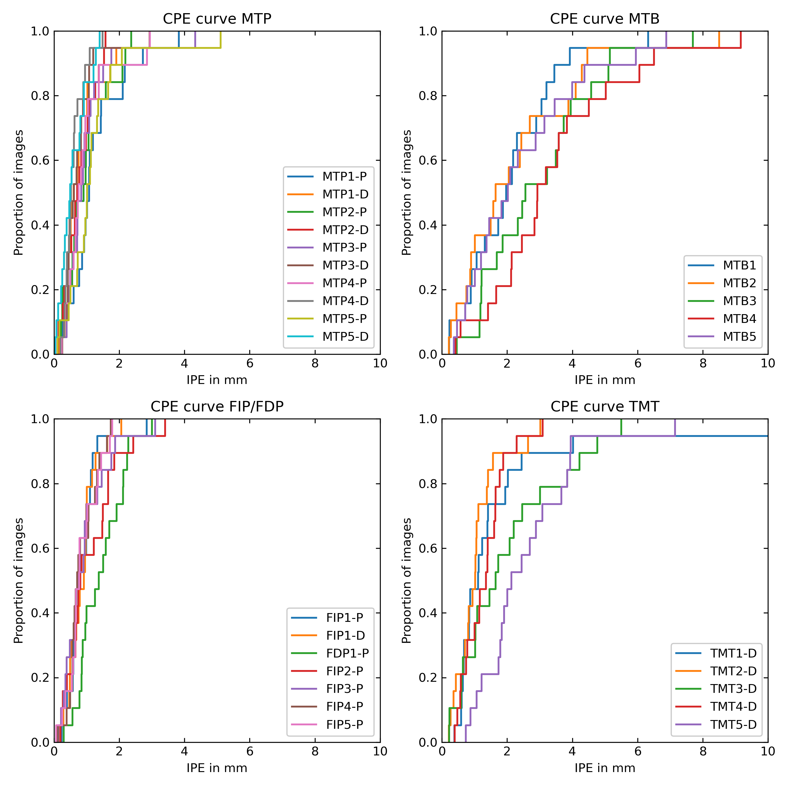
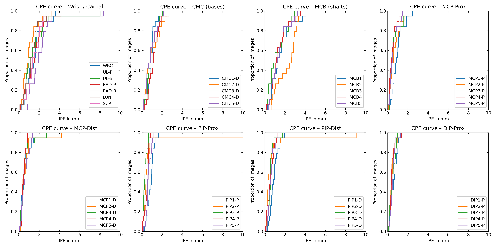
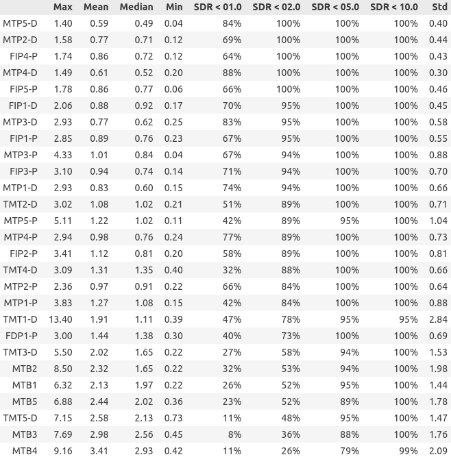
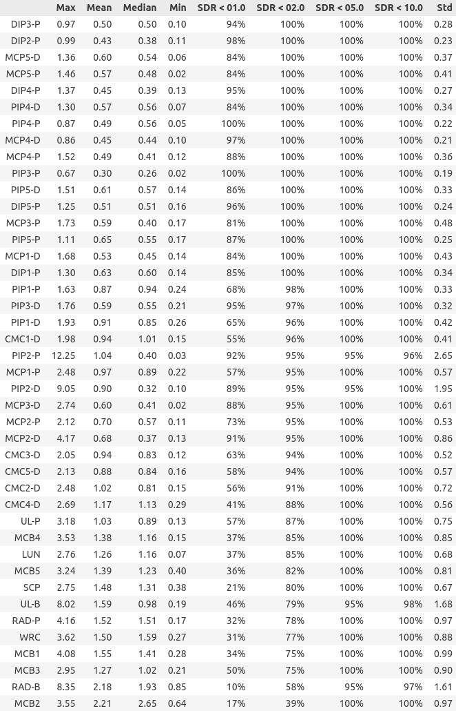

# landmarks_utils

`landmarks_utils` is a Python package for **landmark localization** model training, inference, and annotation, particularly tailored for medical imaging applications.

It builds on [`predict-idlab/landmarker`](https://github.com/predict-idlab/landmarker), with a custom fork at [`ClemensWatzenboeck/landmarker`](https://github.com/ClemensWatzenboeck/landmarker) that includes:

- A **lazy DataLoader** (avoids memory issues on large datasets)
- Other stability and usability fixes for large-scale inference

---

## 🚀 Installation (via conda)

Follow these steps to set up your environment:

```bash
# Step 1: Install CUDA (if using GPU)
# Follow official instructions from: https://developer.nvidia.com/cuda-downloads

# Step 2: Create and activate a conda environment
conda create -n landmark_env python=3.9
conda activate landmark_env

# Step 3: Clone and install the modified landmarker fork
git clone https://github.com/ClemensWatzenboeck/landmarker.git  /path/to/your/local/code/landmarker 
cd /path/to/your/local/code/landmarker
pip install -e .

# Step 4: Install this package (landmarks_utils)
cd /path/to/your/landmarks_utils
pip install -e .
```


#### How to use: 
##### Annotation

Highlights of the provided utility functions are a useful tool to create point-annotations build with `napari`.

After installation and updating the example config files (see `runs/config_/_annotation/config_H.yaml`) it can be stated with

```bash
  landmarks_utils__annotate_landmarks  --config /path/to/runs/config/annotation/config_H.yaml
```

This will start the UI for the annotation. 


<!-----
[🎥 Click here to watch the annotation demo (MP4)](./documentation/images/DEMO_annotation_v1.mkv)
-->

##### Training landmark detection 
Update the config in `./runs/config_landmarks/hands/H_train_landmarks_102p1__updated_data_handler.yaml`

```bash
python ~/code/RA/landmarks_utils/landmarks_utils/training/landmarks/01_train_mlflow.py  \
   --config  `./runs/config_landmarks/hands/H_train_landmarks_102p1__updated_data_handler.yaml
```


##### Inference landmark detection 

Update the config in `./runs/config_landmarks/inference/H_inference_580_cases.yaml`. 
Insert mlflow `runid` of the trained model, path to data, ... 

```bash
python /home/cwatzenboeck/code/RA/landmarks_utils/landmarks_utils/inference/landmarks_inference_v2.py  \
   --config  `./runs/config_landmarks/inference/H_inference_580_cases.yaml
```


---


## 📌 Annotation Examples

  
  
  
  

---

## 🖼️ Demo

- [Annotation Demo 1: Basic point annotations](./documentation/annotation_demo1.md)
- [Annotation Demo 2: Updating predictions of the model](./documentation/annotation_demo2.md)
- [Annotation Demo 3: Training annotators and checking against ground truth](./documentation/annotation_demo3.md)

---

## 🗂️ Patch Extraction Examples

- [Patch Extraction](./documentation/patch_extraction_examples.md)

<!--
  
  
--->

---


## 📈 Metrics & Results

See [notebook feet eval](./nb/landmarks_evaluation/eval_landmarker_02a_reload_F_c580.ipynb) and [notebook hands eval](./nb/landmarks_evaluation/eval_landmarker_02a_reload_H_c580.ipynb).


| CPE Curves (F) | CPE Curves (H) |
| :---: | :---: |
|  |  |

| SDR (F) | SDR (H) |
| :---: | :---: |
|  |  |


---


