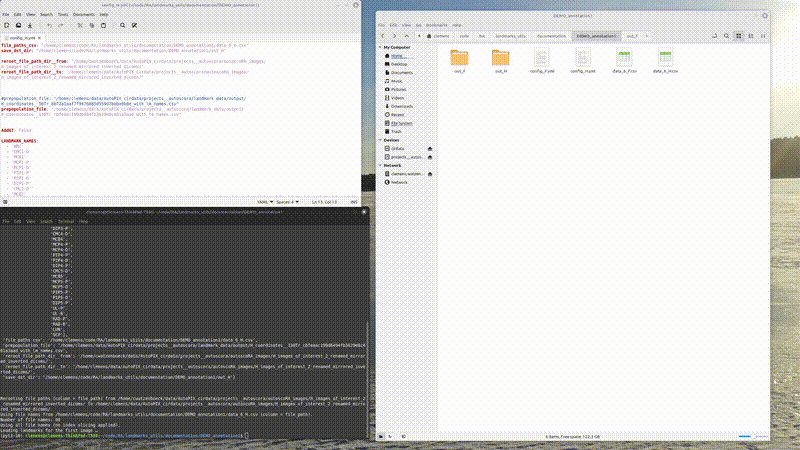

### Landmarks Annotation Demo 2

For my task I created the training set consecutively. Meaning I first trained a model on just a couple of cases and then only corrected the predictions of the model in the rest of the training set. 
"prepopulating" the folder with then landmark annotations via the `landmarks_utils__annotate_landmarks_prepopulate`  and be simply done by first adding the file with the predictions to the config


```yaml
## Part of config_F.yaml 
prepopulation_file: "/home/clemens/data/AutoPIX_cirdata/projects__autoscora/landmark_data/output/F_coordinates__50Tr_715f7467a22945f580262b2aadbc62af_with_lm_names.csv"
```

Note that the table with the file paths needs to contain a column `file_name` on which the table with the predictions of the model are merged with the `data.csv` table containing the file paths. 


Afterwards on simply runs: 

```bash 
   landmarks_utils__annotate_landmarks_prepopulate --config config_F.yml 
```




