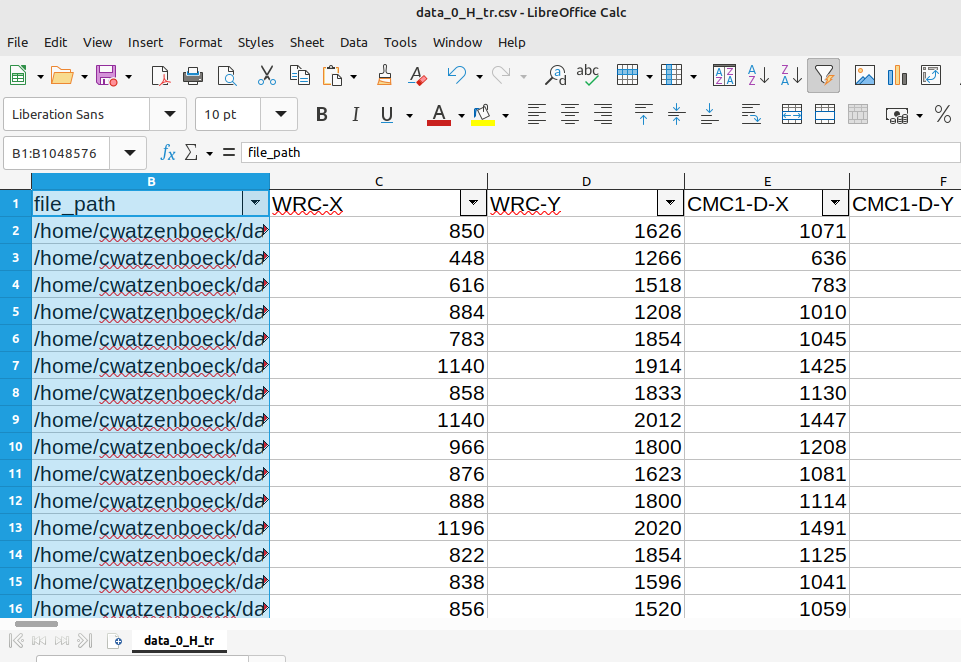
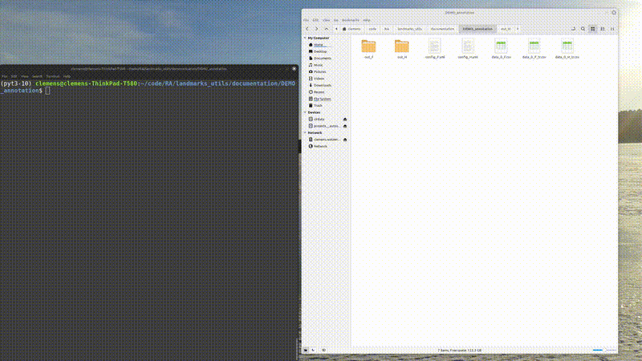

### Landmarks Annotation Demo 3

It can be useful to **add the ground truth** (e.g. results from a previous annotator) to the Napari-based GUI.  
This is especially helpful for training new annotators or validating consistency.

To do this, the ground truth coordinates must be included in the same CSV file that holds the image paths.

📊 **Example Table Format**:



---

🛠️ **How to Enable Ground Truth Display in Config**

In your annotation config file (e.g. `config_H.yaml`), enable the following flag:

```yaml
# config_H.yaml

Add_GT: True
```
``
One can then **toggle** between showing the ground truth and not by pressing the `g` key. 



